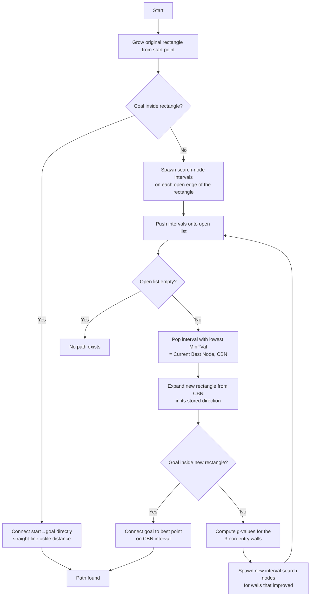
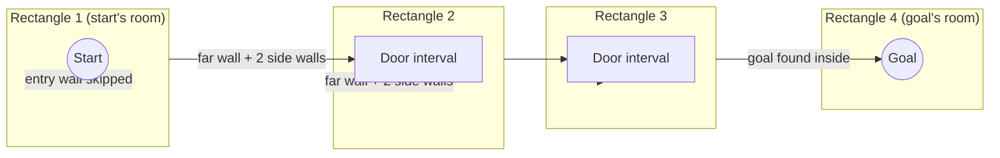
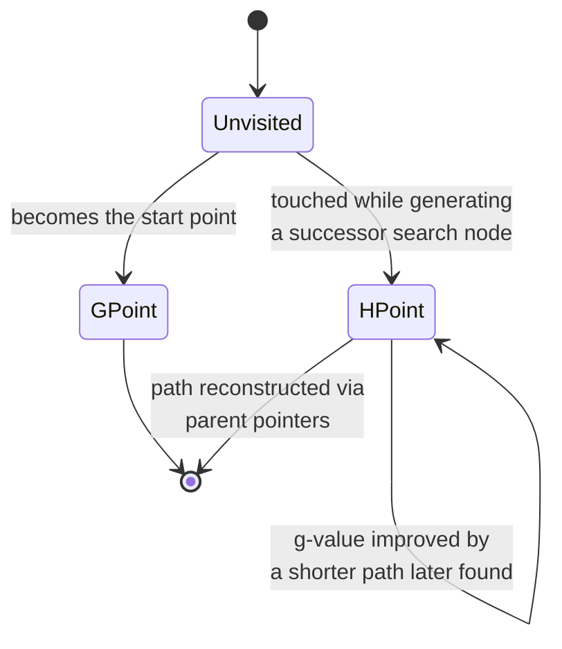

# Rectangle Expansion A* (REA*) — Complete Reference

Source: Zhang An, Li Chong, Bi Wenhao. *"Rectangle expansion A* pathfinding for grid maps."* Chinese Journal of Aeronautics, Vol. 29, Issue 5, 2016, pp. 1385–1396.

---

## TL;DR

REA* is a variant of A* for grid maps that expands **whole unblocked rectangles** instead of individual cells. Interior cells are pruned; only rectangle boundary intervals act as search nodes. This shrinks the open list dramatically, speeds up search by 4–26x over optimized A*, requires **zero pre-processing**, and — as a side effect — produces paths that are usually *shorter* than standard grid-optimal, since waypoints are always connected by obstacle-free straight lines.

---

## 1. Abstract (paper summary)


---

## 2. Related Work — where REA* sits among other speedups

| Algorithm | Approach | Pre-processing | Path quality | Notes |
|---|---|---|---|---|
| **A\*** | Expand one cell at a time | None | Grid-optimal | The baseline; gold standard for correctness |
| **RSR** (Rectangular Symmetry Reduction) | Divides map into obstacle-free rectangles, replaces interior with macro-edges | **Required** (offline) | Grid-optimal | Still visits boundary nodes individually |
| **Block A\*** | Pre-computes all pairwise distances within small blocks (≤5×5) into a lookup database | **Required** (offline, large DB) | Grid-optimal (4-connected only) | Doesn't scale — DB size explodes with block size |
| **JPS** (Jump Point Search) | Skips "uninteresting" intermediate cells, expands only jump points | None | Grid-optimal | Current online state-of-the-art prior to REA* |
| **Anya A\*** | Uses contiguous horizontal/vertical line segments as nodes | None | True any-angle (not grid-constrained) | Expensive line-of-sight tests per expansion |
| **Theta\*/Lazy Theta\*** | Straightens path during/after search | None | Any-angle | Extra visibility tests cost speed |
| **REA\*** | Expands whole unblocked rectangles; boundary intervals are search nodes | **None** | Grid-optimal, but *usually shorter in practice* | This document's subject |

---

## 3. How REA* Works

### 3.1 Core concept

Standard A* asks: *"which single cell should I visit next?"*
REA* asks: *"how far can I see in each direction before I hit a wall — and can I skip everything in between?"*

Each **search node** in REA* is not a point but an **interval** — a contiguous run of open cells along one row or column. An unblocked rectangle is treated as a "room"; its open boundary segments are the "doors" leading to the next room.

### 3.2 High-level flow



### 3.3 Rectangle "room and door" model



Each arrow into a new rectangle only comes from **3 of its 4 walls** — the wall you entered through is never re-expanded, since that would just walk back into the room you came from.

### 3.4 Point-state lifecycle

Every grid cell moves through, at most, these states during a search:



- **GPoint**: a point whose real shortest distance from the start is already settled (currently only the start point itself in this implementation).
- **HPoint**: a point that has an h-value (heuristic to goal) computed and is being tracked as a candidate on a search-node interval.

### 3.5 Sequence of a single expansion step

```mermaid
sequenceDiagram
    participant OL as Open List
    participant CBN as Current Best Node (interval)
    participant Rect as New Rectangle
    participant Wall as Wall Scan
    OL->>CBN: Pop node with lowest MinFVal
    CBN->>Rect: Expand outward in CBN.Direction<br/>until blocked or map edge
    Rect->>Rect: Check if goal is inside
    alt Goal inside
        Rect-->>OL: Connect goal, terminate
    else Goal not inside
        Rect->>Wall: Scan far wall + 2 side walls
        Wall->>Wall: Split into contiguous open runs
        Wall->>Wall: Compute best g-value per cell<br/>(nearest point on CBN interval)
        Wall-->>OL: Push each improved run<br/>as a new search node
    end
```

---

## 4. Detailed Algorithm Steps

### Step 1 — Validate & initialize
- If start or goal is blocked, fail immediately.
- Reset all cell data to `Unvisited`, `GVal = ∞`.
- Set the start cell: `GVal = 0`, `Mode = GPoint`.

### Step 2 — Grow the original rectangle
- From the start cell, expand **vertically** first: walk up while the cell above is open, walk down while the cell below is open — gives a vertical strip.
- Then expand **horizontally**: walk left as long as the *entire* vertical strip at that column is open; same to the right.
- Result: a maximal unblocked rectangle containing the start point. (The paper notes the order of vertical-then-horizontal expansion doesn't affect correctness, only the exact shape of the first rectangle.)

### Step 3 — Check immediate win
- If the goal falls inside this rectangle, connect it directly to the start with a straight line (real octile distance) and stop.

### Step 4 — Spawn the first search nodes
- If the goal wasn't inside, look at each of the rectangle's 4 edges.
- For each edge, scan the strip of cells **just outside** that edge.
- Break the strip into contiguous **runs of open cells** — a blocked cell splits it into separate runs (these are the paper's *free subintervals*).
- For each run: compute each cell's tentative `GVal` as distance from start. If it improves the cell's current `GVal`, update it and mark it `HPoint`.
- If at least one cell in the run improved, package the whole run into a **search node** carrying: its expansion direction, its interval bounds, and its best-case f-value (`GVal + heuristic to goal`, minimized across the run). Push it onto the open list.

### Step 5 — Main loop
Repeat until the open list is empty or the goal is found:

1. **Pop the best node** — the search node with the lowest `MinFVal` (the "current best node," CBN).
2. **Expand a new rectangle from it** — grow outward from the CBN's interval in its stored direction, keeping the interval's width fixed, until blocked. The CBN's interval becomes the new rectangle's *entry wall*.
3. **Check if goal is inside** — if yes, for every cell in the CBN interval compute `distance-to-that-cell + distance-from-that-cell-to-goal`, take the minimum, assign the goal that `GVal` and parent. Path found — stop.
4. **Otherwise, spawn successors** — look at the **three walls that are not the entry wall** (the far wall continuing the same direction, plus the two side walls). For each, repeat the run-splitting process from Step 4: scan the strip just outside, split into open runs, compute each cell's best `GVal` by checking every point on the CBN interval as a candidate parent, update improved cells, and push any run with an improvement as a new search node.
5. Loop back to step 1.

### Step 6 — Termination
- **Success**: goal found — reconstruct the path by walking parent pointers backward from goal to start, then reverse.
- **Failure**: open list empties with no goal found — no path exists.

### Why this stays optimal
Every wall point's `GVal` is computed from the *actual* shortest distance to any point on the entry interval, never approximated — so any update genuinely represents a shorter path. Because each rectangle is guaranteed obstacle-free, the straight line between any two points inside it is always valid, which is why the final path is often shorter than a standard tile-by-tile A* path even though the search remains grid-optimal.

---

## 5. Optimality (why REA* can't return a wrong answer)

The paper proves optimality by induction on **search nodes**, not individual points:

- A search node is *optimal* if it contains at least one point lying on some true shortest path, whose recorded `GVal` matches that path's actual length so far.
- The very first search node (the original rectangle's boundary) is trivially optimal — every boundary point's distance to the start is exact, guaranteed by the triangle inequality on octile distance.
- **Lemma 1**: whenever an optimal search node is expanded, either the goal is found, or a new optimal search node is generated whose `MinFVal` never exceeds the true shortest path length. This holds because the true shortest path must exit any expanded rectangle through one of its boundary walls — and REA* always captures that exit point's correct distance.
- **Lemma 2**: whatever path REA* eventually returns has length no greater than the `MinFVal` of the node that found it.
- Combining both: REA* cannot terminate with a path longer than optimal, and it cannot skip past the true optimal path without finding it first — so it always returns an optimal grid path if one exists.

---

## 6. Efficiency — why it's fast in practice

- **Rectangle pruning**: interior points are never visited or have their cost computed — the single biggest source of savings.
- **Shorter open list**: only boundary *intervals* go into the open list, not individual points, so there are far fewer, larger entries to manage.
- **Early termination**: if the goal lands inside the very first rectangle, REA* finishes almost immediately — standard A* still has to expand the entire path length cell-by-cell.
- **Better-than-optimal paths for free**: since REA*'s waypoints are always separated by obstacle-free rectangles, connecting them with straight lines is always valid and shorter or equal to the zig-zagging grid path — e.g., the paper's worked example found a real path length of 23.63 versus A*'s grid-optimal 24.07, with the same underlying grid-optimal length.

---

## 7. Suggested Improvements (from the paper, Section 6)

1. **Avoid rescanning** — tag wall points with an expansion direction so later rectangle expansions know not to re-scan areas another search node already covered.
2. **Enlarge the original rectangle** — expand from both the start *and* goal points (or cross-expand in both axes) to get a bigger, more useful first rectangle before falling back to iterative expansion.
3. **Detect semi-closed areas** — while scanning a wall, identify rows/columns that are already fully enclosed by prior obstacles, so the algorithm can skip generating unnecessary new search nodes there.

*(Note: the C# implementation below intentionally omits these — they're pure performance optimizations, not behavioral changes, and can be layered on without altering the algorithm's structure.)*

---

## 8. Experimental Results (from the paper)

Benchmarked on 917,835 instances from the 2015 Grid-Based Path Planning Competition (GPPC), across four map types:

| Map type | Speed-up vs. A* | Notes |
|---|---|---|
| **DAO** (Dragon Age: Origins, 22×28 to 1260×1104) | 4.45x | Irregular, 45°-heavy obstacles reduce gains |
| **BG2** (Baldur's Gate II, 512×512) | 4.67x | Same — jagged diagonal edges fragment rectangles |
| **Rooms** (512×512, room sizes 8×8–64×64) | 5.54x – 23.22x | Best case — large open regions, regular obstacles |
| **Mazes** (512×512, corridor widths 1–32) | 2.04x – 26.27x | Wider corridors → bigger rectangles → bigger wins |

- Path length: REA* returned real (straight-line) path lengths **97.64%–99.65%** of grid-optimal on average — i.e., genuinely shorter in practice, not just equal.
- Compared against RSR, Block A*, and JPS: REA* won on all three evaluation axes (speed, path quality, zero pre-processing cost) — notably, RSR and Block A* both *require* offline pre-processing and REA* still beat them.

---

## 9. REA* vs. Standard A* — Direct Comparison

| Dimension | Standard A* | REA* |
|---|---|---|
| **Unit of search** | One grid cell | Whole unblocked rectangle; interior pruned |
| **Open list size** | Grows large fast, especially in open areas | 0.06%–10% of A*'s total open-list elements (per benchmarks) |
| **Path quality** | Grid-optimal, but often zig-zags | Grid-optimal *and* usually shorter in real distance (97.6–99.65% of grid-optimal length) |
| **Search speed** | Baseline | 4.45x–26.27x faster, depending on map openness |
| **Pre-processing** | None | None |
| **Termination speed** | Must expand full path length even in trivial cases | Goal inside first rectangle → near-instant termination |
| **Best-case map type** | N/A | Large open regions, regular obstacles (rooms, wide mazes) |
| **Worst-case map type** | N/A | Jagged, diagonal-heavy obstacle fields (BG2/DAO) — still 4x+ faster, just less dramatic |
| **Implementation complexity** | Simple, well understood | Meaningfully more complex — interval bookkeeping, wall-splitting, direction tracking |
| **Dynamic/moving obstacles** | Well-understood replanning strategies exist | Not addressed by the paper — flagged as future work |
| **Fit for irregular rectangular cells** (this use case) | Requires manually building a portal/adjacency graph | Naturally *discovers* the irregular rectangle decomposition at search time |

---

## 10. C# Implementation

A clarity-focused port of the algorithm's structure (Sections 3.1–3.4 of the paper). It intentionally omits the paper's O(1) wall-distance shortcut (Section 3.3, which avoids per-point multiplication) and semi-closed-area detection (Section 6.3) — those are pure speed optimizations layered on top, not behavioral differences, and can be added later without changing the shape of this code.

> **Usage:** `new ReaStarPathfinder(blockedGrid).FindPath((0,0), (10,10))` returns a `List<(int x, int y)>` waypoint path, or `null` if unreachable.

```csharp
using System;
using System.Collections.Generic;

/// <summary>
/// Rectangle Expansion A* (REA*) — Zhang, Li, Bi (2016).
///
/// Instead of expanding one grid cell at a time like standard A*, REA* expands
/// whole unblocked RECTANGLES. All interior points of a rectangle are pruned;
/// only the rectangle's open boundary edges ("walls") become search nodes —
/// think of each rectangle as a room, and its exits as doors to the next room.
///
/// This keeps the open list short (few, large search nodes instead of many
/// individual points) and produces paths that are frequently *better* than
/// standard grid-optimal, since consecutive path points are always connected
/// by an obstacle-free straight line inside a rectangle.
///
/// NOTE: This is a clarity-focused port of the algorithm's structure (Sections
/// 3.1–3.4 of the paper). It omits the paper's O(1) wall-distance shortcut
/// (Section 3.3, which avoids per-point multiplication) and semi-closed-area
/// detection (Section 6.3) — those are pure speed optimizations, not
/// behavioral differences, and can be added later without changing the shape
/// of this code.
/// </summary>
public class ReaStarPathfinder
{
    private const float Straight = 1f;
    private const float Diagonal = 1.41421356f;

    private enum Mode { Unvisited, GPoint, HPoint }
    private enum Dir { North, South, East, West }

    private struct PointData
    {
        public float GVal;
        public Mode Mode;
        public bool HasParent;
        public int ParentX, ParentY;
    }

    private struct Rect
    {
        public int MinX, MaxX, MinY, MaxY;
        public bool Contains(int x, int y) => x >= MinX && x <= MaxX && y >= MinY && y <= MaxY;
    }

    // A search node is an INTERVAL (a run of open cells along one row or column),
    // not a single point — this is what lets REA* skip interior cells entirely.
    private class SearchNode
    {
        public Dir Direction;       // which way this node's rectangle should expand
        public bool RunsAlongX;     // true: interval varies in x, fixed y (a horizontal wall)
        public int FixedCoord;      // the fixed row (if RunsAlongX) or column (otherwise)
        public int Lo, Hi;          // inclusive range along the varying axis
        public float MinFVal;       // best-case f-value of any point in this interval
    }

    private readonly bool[,] _blocked; // true = obstacle / impassable
    private readonly int _width, _height;
    private PointData[,] _data;
    private (int x, int y) _goal;

    public ReaStarPathfinder(bool[,] blocked)
    {
        _blocked = blocked;
        _width = blocked.GetLength(0);
        _height = blocked.GetLength(1);
    }

    public List<(int x, int y)> FindPath((int x, int y) start, (int x, int y) goal)
    {
        if (IsBlocked(start.x, start.y) || IsBlocked(goal.x, goal.y))
            return null;

        _goal = goal;
        _data = new PointData[_width, _height];
        for (int x = 0; x < _width; x++)
            for (int y = 0; y < _height; y++)
                _data[x, y] = new PointData { Mode = Mode.Unvisited, GVal = float.PositiveInfinity };

        var open = new List<SearchNode>(); // simple list used as a priority queue (see PopBest)

        _data[start.x, start.y] = new PointData { GVal = 0, Mode = Mode.GPoint };

        if (InsertStart(start, open))
            return Reconstruct();

        while (open.Count > 0)
        {
            var cbn = PopBest(open);
            if (Expand(cbn, open))
                return Reconstruct();
        }

        return null; // no path exists
    }

    // ---------------------------------------------------------------
    // 3.1  Insert start point — grow the very first rectangle
    // ---------------------------------------------------------------
    private bool InsertStart((int x, int y) start, List<SearchNode> open)
    {
        Rect rect = ExpandRectangleFrom(start.x, start.y);

        if (rect.Contains(_goal.x, _goal.y))
        {
            SetPoint(_goal.x, _goal.y, Octile(start, _goal), start.x, start.y, Mode.HPoint);
            return true;
        }

        // Every open edge of the original rectangle becomes a candidate search node.
        TrySpawnWall(rect, Dir.North, start, open);
        TrySpawnWall(rect, Dir.South, start, open);
        TrySpawnWall(rect, Dir.East, start, open);
        TrySpawnWall(rect, Dir.West, start, open);
        return false;
    }

    // ---------------------------------------------------------------
    // 3.3  Expand an unblocked rectangle from the current best search node
    // ---------------------------------------------------------------
    private bool Expand(SearchNode cbn, List<SearchNode> open)
    {
        // The rectangle grows in cbn.Direction, staying within [Lo, Hi] on the
        // perpendicular axis (the interval's own width does not change here —
        // widening happens naturally when successor intervals are generated).
        Rect rect = ExpandRectangleFromInterval(cbn);

        if (rect.Contains(_goal.x, _goal.y))
        {
            AssignWallGVals(rect, cbn);
            ConnectGoalWithinRect(rect, cbn);
            return true;
        }

        AssignWallGVals(rect, cbn);

        // The three interior boundaries other than the entry wall become the
        // next round of search-node intervals (the paper's "doors to the next room").
        foreach (var dir in OtherWalls(cbn.Direction))
            TrySpawnWallFromRect(rect, dir, cbn, open);

        return false;
    }

    // ---------------------------------------------------------------
    // Rectangle growth helpers
    // ---------------------------------------------------------------

    // Original-rectangle rule (Sec. 3.1): expand vertically from the point first,
    // then sweep horizontally as far as the whole vertical span stays open.
    private Rect ExpandRectangleFrom(int x, int y)
    {
        int minY = y, maxY = y;
        while (!IsBlocked(x, minY - 1)) minY--;
        while (!IsBlocked(x, maxY + 1)) maxY++;

        int minX = x, maxX = x;
        while (ColumnOpen(minX - 1, minY, maxY)) minX--;
        while (ColumnOpen(maxX + 1, minY, maxY)) maxX++;

        return new Rect { MinX = minX, MaxX = maxX, MinY = minY, MaxY = maxY };
    }

    // Grow a rectangle outward from a search-node interval in its expansion direction.
    private Rect ExpandRectangleFromInterval(SearchNode node)
    {
        if (node.RunsAlongX)
        {
            int y = node.FixedCoord;
            int step = node.Direction == Dir.North ? -1 : 1;
            int edge = y;
            while (RowOpen(edge + step, node.Lo, node.Hi)) edge += step;

            int minY = Math.Min(y, edge), maxY = Math.Max(y, edge);
            return new Rect { MinX = node.Lo, MaxX = node.Hi, MinY = minY, MaxY = maxY };
        }
        else
        {
            int x = node.FixedCoord;
            int step = node.Direction == Dir.West ? -1 : 1;
            int edge = x;
            while (ColumnOpen(edge + step, node.Lo, node.Hi)) edge += step;

            int minX = Math.Min(x, edge), maxX = Math.Max(x, edge);
            return new Rect { MinX = minX, MaxX = maxX, MinY = node.Lo, MaxY = node.Hi };
        }
    }

    private bool ColumnOpen(int x, int minY, int maxY)
    {
        for (int y = minY; y <= maxY; y++)
            if (IsBlocked(x, y)) return false;
        return true;
    }

    private bool RowOpen(int y, int minX, int maxX)
    {
        for (int x = minX; x <= maxX; x++)
            if (IsBlocked(x, y)) return false;
        return true;
    }

    // ---------------------------------------------------------------
    // 3.2  Generate successor search nodes from a rectangle's open walls
    // ---------------------------------------------------------------
    private void TrySpawnWall(Rect rect, Dir dir, (int x, int y) origin, List<SearchNode> open)
        => TrySpawnWallFromRect(rect, dir, null, origin, open);

    private void TrySpawnWallFromRect(Rect r, Dir dir, SearchNode parent, List<SearchNode> open)
        => TrySpawnWallFromRect(r, dir, parent, null, open);

    // parent = the interval the entrant path is coming from (null only for the very first rectangle)
    // origin = the raw start point, used only when parent is null
    private void TrySpawnWallFromRect(Rect r, Dir dir, SearchNode parent, (int x, int y)? origin, List<SearchNode> open)
    {
        // Compute the wall line just outside the rectangle in direction `dir`,
        // split it into contiguous unblocked runs (free sub-intervals), and
        // push each run whose points actually improve as a new search node.
        bool runsAlongX = dir == Dir.North || dir == Dir.South;
        int fixedCoord = dir switch
        {
            Dir.North => r.MinY - 1,
            Dir.South => r.MaxY + 1,
            Dir.West => r.MinX - 1,
            Dir.East => r.MaxX + 1,
            _ => 0
        };

        if (fixedCoord < 0 || (runsAlongX && fixedCoord >= _height) || (!runsAlongX && fixedCoord >= _width))
            return; // off map

        int lo = runsAlongX ? r.MinX : r.MinY;
        int hi = runsAlongX ? r.MaxX : r.MaxY;

        int runStart = -1;
        for (int i = lo; i <= hi + 1; i++)
        {
            bool cellOpen = i <= hi && !(runsAlongX ? IsBlocked(i, fixedCoord) : IsBlocked(fixedCoord, i));
            if (cellOpen && runStart == -1) runStart = i;
            if (!cellOpen && runStart != -1)
            {
                EmitRun(runsAlongX, fixedCoord, runStart, i - 1, dir, parent, origin, open);
                runStart = -1;
            }
        }
    }

    private void EmitRun(bool runsAlongX, int fixedCoord, int lo, int hi, Dir dir,
                          SearchNode parent, (int x, int y)? origin, List<SearchNode> open)
    {
        float bestF = float.PositiveInfinity;
        bool anyImproved = false;

        for (int i = lo; i <= hi; i++)
        {
            int x = runsAlongX ? i : fixedCoord;
            int y = runsAlongX ? fixedCoord : i;

            var (candidateG, px, py) = BestParent(x, y, parent, origin);
            if (candidateG < _data[x, y].GVal)
            {
                anyImproved = true;
                SetPoint(x, y, candidateG, px, py, Mode.HPoint);
            }

            if (_data[x, y].Mode != Mode.Unvisited)
            {
                float f = _data[x, y].GVal + Octile((x, y), _goal);
                if (f < bestF) bestF = f;
            }
        }

        if (!anyImproved) return;

        open.Add(new SearchNode
        {
            Direction = dir,
            RunsAlongX = runsAlongX,
            FixedCoord = fixedCoord,
            Lo = lo,
            Hi = hi,
            MinFVal = bestF
        });
    }

    // Distance from the nearest point on the entry interval (or the raw start
    // point, for the very first rectangle) to (x, y). Returns (gVal, parentX, parentY).
    // Simplified stand-in for the paper's O(1) diagonal-sweep trick (Sec. 3.3):
    // scans the parent interval directly. Correct, just not asymptotically optimal.
    private (float g, int px, int py) BestParent(int x, int y, SearchNode parent, (int x, int y)? origin)
    {
        if (parent == null)
        {
            var o = origin!.Value;
            return (Octile((x, y), o), o.x, o.y);
        }

        float best = float.PositiveInfinity;
        (int x, int y) bestPt = default;
        for (int i = parent.Lo; i <= parent.Hi; i++)
        {
            int qx = parent.RunsAlongX ? i : parent.FixedCoord;
            int qy = parent.RunsAlongX ? parent.FixedCoord : i;
            if (_data[qx, qy].Mode == Mode.Unvisited) continue;
            float g = _data[qx, qy].GVal + Octile((qx, qy), (x, y));
            if (g < best) { best = g; bestPt = (qx, qy); }
        }
        return (best, bestPt.x, bestPt.y);
    }

    private void AssignWallGVals(Rect rect, SearchNode cbn)
    {
        // g-values for interior boundary points are assigned inline inside
        // EmitRun/BestParent as each wall's successor intervals are generated.
    }

    private void ConnectGoalWithinRect(Rect rect, SearchNode cbn)
    {
        float best = float.PositiveInfinity;
        (int x, int y) bestParent = default;
        for (int i = cbn.Lo; i <= cbn.Hi; i++)
        {
            int px = cbn.RunsAlongX ? i : cbn.FixedCoord;
            int py = cbn.RunsAlongX ? cbn.FixedCoord : i;
            if (_data[px, py].Mode == Mode.Unvisited) continue;
            float g = _data[px, py].GVal + Octile((px, py), _goal);
            if (g < best) { best = g; bestParent = (px, py); }
        }
        SetPoint(_goal.x, _goal.y, best, bestParent.x, bestParent.y, Mode.HPoint);
    }

    // Given the direction a rectangle expanded in, returns the 3 walls that can
    // spawn successor search nodes: the far wall (continuing the same way) plus
    // both perpendicular walls. The near wall (Opposite(direction)) is excluded
    // because that's the entry side — generating it would just walk back into
    // the rectangle we came from.
    private static Dir[] OtherWalls(Dir direction) => direction switch
    {
        Dir.North => new[] { Dir.North, Dir.East, Dir.West },
        Dir.South => new[] { Dir.South, Dir.East, Dir.West },
        Dir.East => new[] { Dir.East, Dir.North, Dir.South },
        Dir.West => new[] { Dir.West, Dir.North, Dir.South },
        _ => Array.Empty<Dir>()
    };

    // ---------------------------------------------------------------
    // Bookkeeping
    // ---------------------------------------------------------------
    private void SetPoint(int x, int y, float gVal, int parentX, int parentY, Mode mode)
    {
        _data[x, y] = new PointData
        {
            GVal = gVal,
            Mode = mode,
            HasParent = true,
            ParentX = parentX,
            ParentY = parentY
        };
    }

    private bool IsBlocked(int x, int y)
    {
        if (x < 0 || y < 0 || x >= _width || y >= _height) return true;
        return _blocked[x, y];
    }

    private static float Octile((int x, int y) a, (int x, int y) b)
    {
        int dx = Math.Abs(a.x - b.x), dy = Math.Abs(a.y - b.y);
        int dMin = Math.Min(dx, dy), dMax = Math.Max(dx, dy);
        return dMin * Diagonal + (dMax - dMin) * Straight;
    }

    // Open list stand-in — swap for a binary heap keyed on MinFVal in production.
    private static SearchNode PopBest(List<SearchNode> open)
    {
        int bestIdx = 0;
        for (int i = 1; i < open.Count; i++)
            if (open[i].MinFVal < open[bestIdx].MinFVal) bestIdx = i;
        var node = open[bestIdx];
        open.RemoveAt(bestIdx);
        return node;
    }

    private List<(int x, int y)> Reconstruct()
    {
        var path = new List<(int x, int y)>();
        int x = _goal.x, y = _goal.y;
        path.Add((x, y));
        while (_data[x, y].HasParent)
        {
            var d = _data[x, y];
            x = d.ParentX;
            y = d.ParentY;
            path.Add((x, y));
        }
        path.Reverse();
        return path;
    }
}
```

---

## 11. Known Simplifications & Caveats (this implementation)

| Simplification | Paper's version | Impact |
|---|---|---|
| `PopBest` linear scan | Ordered binary heap | O(n) instead of O(log n) per pop — fine for small/medium grids, swap to `PriorityQueue<SearchNode, float>` for large maps |
| `BestParent` rescans full parent interval per point | O(1) diagonal-sweep distance trick (Sec. 3.3) | Correct results, but asymptotically slower than the paper's version |
| No rescanning avoidance (Sec. 6.1) | Direction-tagged wall points prevent redundant scans | May do some duplicate work on complex maps |
| No semi-closed area detection (Sec. 6.3) | Skips generating unnecessary search nodes in enclosed pockets | Slightly more search-node churn on maze-like maps |
| No original-rectangle enlargement (Sec. 6.2) | Cross-expand from both start and goal | First rectangle may be smaller than optimal |

None of these affect **correctness** — they're pure performance optimizations layered on top of the same algorithmic skeleton, and can be added incrementally without restructuring the code.

**Not yet verified by compilation** — there was no .NET/Mono toolchain available in the environment this was written in. The geometry and control flow were traced by hand (and one real bug — backwards wall-exclusion logic in `OtherWalls` — was caught and fixed this way), but you should compile and run it against a few known test grids before trusting it in production.

---

## 12. Relevance to Irregular-Cell Pathfinding

This algorithm is the natural fit for a map made of irregular rectangular cells (e.g., 5×4 next to 3×3), because REA* does automatically, at search time, exactly what you'd otherwise have to hand-build as a portal/adjacency graph: it discovers the map's natural decomposition into variable-sized unblocked rectangles and paths across their shared boundaries using real geometric distance — no manual node/edge authoring required.
