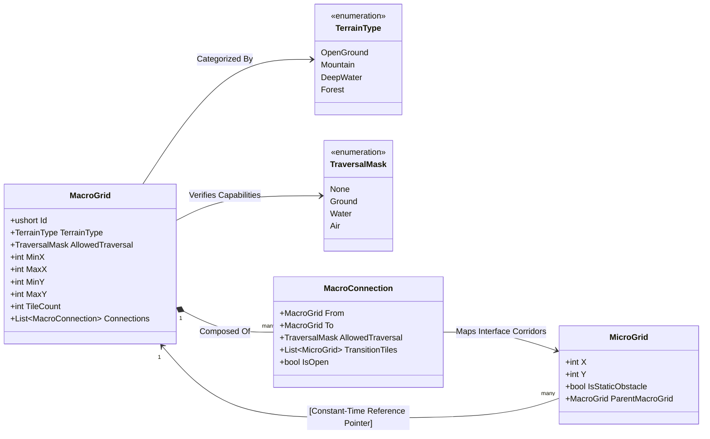
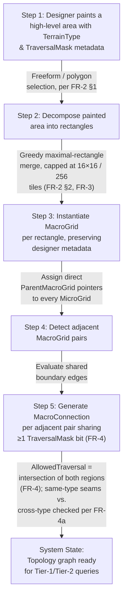
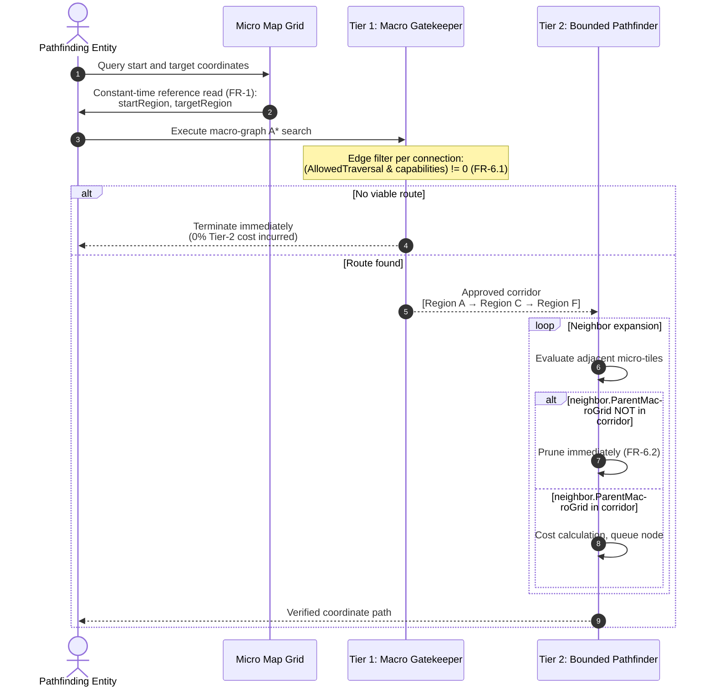

# Software Requirements Specification (SRS)
## Hierarchical Homogeneous Spatial Indexing & Pathfinding (HHSI)

*Structured per IEEE 830 conventions (Introduction → Overall Description → Specific Requirements). Sections below are trimmed to what's relevant for a single-system, solo-developer spec rather than a full multi-stakeholder contract document — the standard's shape is kept, the ceremony isn't.*

---

## 1. Introduction

### 1.1 Purpose
This document specifies the design and behavioral requirements for HHSI, a two-tier spatial indexing and pathfinding system for Divrom. It exists to address the practical limits of running standard A* directly over a large tile grid — namely, search cost scaling with world size and full graph re-evaluation on every query — by adding a coarse region layer that narrows the search space before any tile-level A* runs, while still tolerating dynamic entities without recomputation and supporting heterogeneous unit movement types (ground, water, air) without maintaining separate navigation graphs per type.

### 1.2 Scope
HHSI covers:
- Constant-time mapping from a world tile to its containing macro-region.
- Bake-time generation of macro-regions from designer-painted terrain metadata.
- Bake-time generation of inter-region portals and their traversal permissions.
- Two-tier runtime pathfinding: a coarse macro-graph gatekeeper search, followed by a micro-tile search bounded to the approved region corridor.

HHSI does **not** cover: dynamic obstacle avoidance logic (steering, local avoidance), the destructible-terrain event pipeline, or animation/movement execution — those are separate systems that consume HHSI's output.

### 1.3 Definitions, Acronyms, Abbreviations
| Term | Meaning |
|---|---|
| **Micro-tile** | The uniform 1×1 base unit of the world grid. |
| **Macro-grid / Region** | A designer-defined, algorithmically-decomposed rectangular grouping of micro-tiles sharing identical terrain metadata. |
| **Portal / MacroConnection** | An explicit, bake-time-generated traversal link between two adjacent macro-grids. |
| **TraversalMask** | A bitmask describing which movement types (Ground, Water, Air, …) can use a region or portal. |
| **Gatekeeper search** | The Tier-1 macro-graph search that determines route feasibility before any micro-tile search runs. |
| **Corridor** | The ordered list of macro-grids approved by the Tier-1 search, within which Tier-2 search is bounded. |

### 1.4 References
- Botea, Müller, Schaeffer. *"Near Optimal Hierarchical Path-Finding."* Journal of Game Development, 2004. (HPA\* — cited as attribution: this design follows the same general two-tier region/gatekeeper shape, arrived at independently for this project's specific constraints.)
- IEEE 830-1998, *Recommended Practice for Software Requirements Specifications* (structural template for this document).

### 1.5 Overview
Section 2 covers the design rationale (why standard A* alone was insufficient at target scale, why the pointer-indexing and hierarchical approach was chosen). Section 3 specifies the concrete data model, generation pipeline, and runtime behavior. Section 4 covers non-functional requirements. Section 5 is an appendix with implementation notes and open decisions.

---

## 2. Overall Description

### 2.1 Product Perspective
HHSI sits between the level-authoring pipeline (where terrain metadata is painted) and the gameplay movement systems (which consume computed paths). It is a bake-once, query-many system: all region and portal data is generated once — at level load or level edit time — and queried cheaply at runtime by any number of moving entities per frame.

### 2.2 User Classes
- **Level designer**: paints terrain type and traversal metadata onto the map; does not write code to define regions.
- **Gameplay/AI systems**: query HHSI for a path given a start point, target point, and mover's traversal capabilities.
- **HHSI bake pipeline**: an internal, non-interactive process invoked automatically after metadata painting.

### 2.3 Assumptions & Dependencies
- The world is representable as a uniform 2D (or per-layer 2D) tile grid.
- Terrain metadata (TerrainType, TraversalMask) is static at runtime except through explicit, event-driven change (destructible terrain, openable doors) — not continuous per-frame change.
- Dynamic entity occupancy (players, MOBs) is tracked by a separate, live system and is never baked into region/portal data (see §2.5).

### 2.4 Design Rationale — Why Standard A* Alone Was Not Used
Running A* directly over the full micro-tile grid produces correct paths, but at Divrom's target scale the cost of doing so is the actual problem. Two properties of plain tile-by-tile A* make it a poor fit:

1. **Search cost scales with the number of tiles a query has to traverse**, not with how conceptually "simple" the route is. A query that only needs to know "can I get from this room to that room" still pays for expanding every intermediate tile one at a time.
2. **Every query re-derives structure the world already has.** The map's rooms, corridors, and terrain boundaries don't change from one pathfinding request to the next, but plain A* has no way to reuse that — it treats every search as if the map's shape were being discovered from scratch.

HHSI's two-tier split exists to fix both: a one-time bake pass captures the map's stable shape as a small region graph, and a coarse Tier-1 A* search over that graph (cheap, because the graph is tiny relative to the tile grid) decides *whether and roughly where* a route exists before any expensive tile-level A* runs at all. Tile-level A* (Tier 2) still does the real work — it's the same algorithm, just bounded to a small, pre-approved slice of the map instead of the whole grid. This directly motivated separating **static structure** (regions, portals — baked once) from **dynamic occupancy** (never baked, queried live) as a first-class architectural principle, detailed in §2.5.

### 2.5 Design Rationale — Static vs. Dynamic Separation
| Layer | Update frequency | Storage |
|---|---|---|
| Region/portal topology | Bake-time only; re-baked only on structural change (see §3.5) | Cached in `MacroGrid` / `MacroConnection` |
| Static tile walkability | Bake-time; event-driven local re-bake on destruction | `MicroGrid.IsStaticObstacle` |
| Door open/closed state | Event-driven, rare | `MacroConnection` flag |
| Dynamic entity occupancy | Every frame | Separate live spatial hash — **out of scope for HHSI itself** |

This separation is what makes the bake-once approach in §2.4 actually pay off: nothing about a MOB or player standing somewhere ever invalidates region or portal topology, so the one-time cost of building the region graph never has to be repeated during normal gameplay.

### 2.6 Design Rationale — Why Homogeneous Regions Are Required

HHSI requires every `MacroGrid` to represent a homogeneous semantic area, meaning all contained micro-tiles share the same `TerrainType` and `TraversalMask`.

This constraint exists to ensure that the macro layer can operate independently of micro-tile inspection. If a region contained heterogeneous terrain, its traversal capabilities would need to be derived from a combination of its constituent tiles, forcing either complex aggregate metadata calculations during the bake process or repeated micro-level validation during Tier-1 search.

By enforcing homogeneity, a region's traversal metadata remains a complete and accurate representation of every tile it contains. Tier-1 search can therefore determine region and portal traversability using a single metadata comparison without consulting underlying micro-tiles.

This design also simplifies structural updates. Dynamic changes that affect individual tiles generally modify only `MicroGrid.IsStaticObstacle` data, while region traversal semantics remain unchanged. As a result, most runtime changes can be handled without regenerating region metadata, preserving the separation between the macro and micro layers described in §2.5.

---

## 3. Specific Requirements

### 3.1 Data Model

```csharp
[Flags]
public enum TraversalMask
{
    None   = 0,
    Ground = 1 << 0,
    Water  = 1 << 1,
    Air    = 1 << 2
}

public enum TerrainType { OpenGround, Mountain, DeepWater, Forest }

public sealed class MacroGrid
{
    public ushort Id { get; }
    public TerrainType TerrainType { get; set; }
    public TraversalMask AllowedTraversal { get; set; }
    public int MinX, MaxX, MinY, MaxY;
    public int TileCount;
    public List<MacroConnection> Connections { get; } = new();

    public MacroGrid(ushort id) { Id = id; }
}

public sealed class MicroGrid
{
    public int X { get; }
    public int Y { get; }
    public bool IsStaticObstacle { get; set; }
    public MacroGrid ParentMacroGrid { get; set; } // constant-time region reference

    public MicroGrid(int x, int y) { X = x; Y = y; }
}

public sealed class MacroConnection
{
    public MacroGrid From { get; init; }
    public MacroGrid To { get; init; }
    public TraversalMask AllowedTraversal { get; init; } // see FR-4
    public List<MicroGrid> TransitionTiles { get; } = new();
    public bool IsOpen { get; set; } = true; // for gated/door portals
}
```

#### 3.1.1 Structural Relationships (UML Class Diagram)



*Note: `MacroConnection.AllowedTraversal` is always derived per FR-4 (`From.AllowedTraversal & To.AllowedTraversal`), never independently authored — the diagram shows it as a stored field because it's computed once at bake time and cached, not because it's a free-standing design choice.*

#### 3.1.2 Bake Pipeline Overview (informative — illustrates FR-2 through FR-5)



**Note on region generation method:** homogeneous regions must be derived from designer-painted areas, not discovered automatically via flood-fill over raw terrain data. Flood-fill cannot guarantee rectangular output, which breaks FR-5's on-the-fly cost model. The pipeline above decomposes designer-painted areas into guaranteed rectangles instead; the designer defines *what* is homogeneous, the algorithm only decides *how to cut it into rectangles*.

### 3.2 Functional Requirements

**FR-1 — Constant-Time Region Lookup**
Every `MicroGrid` shall hold a direct object reference to its owning `MacroGrid`. Resolving a tile's region shall require exactly one pointer dereference and no search, tree traversal, or dictionary lookup, regardless of world size.

**FR-2 — Metadata-Driven Region Definition (hybrid painting approach)**
Regions shall be defined by a two-stage designer/algorithm split, not by either pure hand-authoring or pure automatic flood-fill:
1. The **designer selects a high-level area** of the map (a freeform or polygon selection) and paints it with terrain metadata (`TerrainType`, `TraversalMask`).
2. The **algorithm then decomposes** that painted area into one or more axis-aligned rectangular `MacroGrid` instances, each bounded to a configurable maximum size (default 16×16 / 256 tiles), preserving the designer's metadata on every resulting piece.

This hybrid approach is required — rather than pure flood-fill from raw terrain data — because it keeps region shape guaranteed-rectangular (needed for FR-5's on-the-fly cost model) while keeping region *semantics* under explicit designer control rather than inferred from tile adjacency alone.

**FR-3 — Decomposition Strategy**
The decomposition step in FR-2 shall use a greedy maximal-rectangle merge (grow the largest valid rectangle from a seed tile, repeat over remaining unclaimed tiles) rather than a naive fixed-size grid chop. This is a one-time bake cost and is justified because it minimizes the number of resulting `MacroGrid` nodes and portals, directly reducing Tier-1 gatekeeper search cost at runtime. A naive fixed chop is acceptable as a fallback implementation if development time is constrained, with the understanding that it will produce more, smaller regions along irregular painted edges.

**Example implementation:**

```csharp
public static class RegionDecomposer
{
    private const int MaxWidth = 16;
    private const int MaxHeight = 16;
    private const int MaxTileCount = 256;

    /// <summary>
    /// Splits one designer-painted area (a set of tile coordinates sharing
    /// identical TerrainType/TraversalMask) into the minimum practical number
    /// of axis-aligned rectangles, each capped per FR-2/FR-3/§3.5.
    /// Scans in row-major order and grows the largest legal rectangle from
    /// each unclaimed seed tile before moving on.
    /// </summary>
    public static List<RectInt> Decompose(HashSet<Vector2Int> paintedTiles)
    {
        var unclaimed = new HashSet<Vector2Int>(paintedTiles);
        var result = new List<RectInt>();

        // Row-major scan order keeps rectangle growth simple and deterministic.
        var ordered = unclaimed.OrderBy(t => t.y).ThenBy(t => t.x).ToList();

        foreach (var seed in ordered)
        {
            if (!unclaimed.Contains(seed))
                continue; // already absorbed into an earlier rectangle

            RectInt rect = GrowRectangleFrom(seed, unclaimed);

            for (int y = rect.yMin; y < rect.yMax; y++)
                for (int x = rect.xMin; x < rect.xMax; x++)
                    unclaimed.Remove(new Vector2Int(x, y));

            result.Add(rect);
        }

        return result;
    }

    private static RectInt GrowRectangleFrom(Vector2Int seed, HashSet<Vector2Int> unclaimed)
    {
        // Step 1: grow width along the seed's row, capped at MaxWidth.
        int width = 1;
        while (width < MaxWidth &&
               unclaimed.Contains(new Vector2Int(seed.x + width, seed.y)))
        {
            width++;
        }

        // Step 2: grow height downward only while the *entire* width-span
        // of the next row is still unclaimed — this is what keeps the
        // result a true rectangle instead of a jagged region.
        int height = 1;
        while (height < MaxHeight &&
               (height + 1) * width <= MaxTileCount &&
               RowSpanUnclaimed(seed.x, seed.y + height, width, unclaimed))
        {
            height++;
        }

        return new RectInt(seed.x, seed.y, width, height);
    }

    private static bool RowSpanUnclaimed(int startX, int y, int width, HashSet<Vector2Int> unclaimed)
    {
        for (int dx = 0; dx < width; dx++)
            if (!unclaimed.Contains(new Vector2Int(startX + dx, y)))
                return false;
        return true;
    }
}
```

This is the same "expand width first, then push height as far as the whole span stays valid" shape used elsewhere in this project's rectangle-growth code — it keeps every output piece a guaranteed rectangle by construction, which is the property FR-5's on-the-fly cost model depends on. The fixed-chop fallback mentioned above is simpler: skip `GrowRectangleFrom` entirely and instead slice `paintedTiles`'s bounding box into a fixed `MaxWidth × MaxHeight` lattice, discarding any grid cell with zero painted tiles inside it.

**FR-4 — Portal Generation & Traversal Derivation**
For every pair of adjacent `MacroGrid` instances (sharing a boundary edge, from the *same or different* designer-painted areas), the bake pipeline shall generate a `MacroConnection` if and only if at least one `TraversalMask` bit is shared between them. The connection's `AllowedTraversal` shall be computed as the **bitwise intersection**, not union, of the two regions' masks:
```csharp
connection.AllowedTraversal = regionA.AllowedTraversal & regionB.AllowedTraversal;
```
This is a hard requirement, not a style preference — a union would incorrectly allow a unit to "enter" an adjacent region it cannot actually stand in.

**FR-4a — Same-type vs. cross-type portals**
Portals between two `MacroGrid` pieces that originated from the *same* designer-painted area and share identical metadata shall be treated as unconditionally open internal seams (no mask check needed at query time, since the intersection is trivially the full mask). Portals at the boundary between two *differently*-painted areas shall always be evaluated via the FR-4 intersection check. Implementations may special-case the former for a minor runtime saving, but both cases must be present as real graph edges.

**FR-5 — Portal Cost: Computed On-Demand, Not Baked**
Because FR-2/FR-3 guarantee every `MacroGrid` is a true rectangle with no static obstacles considered at the macro level, portal-to-portal traversal cost for the Tier-1 gatekeeper search shall be computed on-demand as straight-line (Euclidean or octile) distance between portal midpoints, and shall **not** be baked or cached. This is valid specifically because Tier-1 is a coarse feasibility/ordering gatekeeper (per FR-6), not the source of the final path cost — exact cost is Tier-2's responsibility.

**FR-6 — Two-Tier Search Pipeline**
1. **Tier 1 (macro gatekeeper):** Given a start tile and target tile, resolve both to their `MacroGrid` via FR-1, then run A* over the macro-graph using FR-5 costs and filtering edges by `(connection.AllowedTraversal & unit.TraversalCapabilities) != 0`. If no route exists, the pathfinding request terminates immediately with zero Tier-2 cost incurred.
2. **Tier 2 (bounded micro search):** If Tier 1 succeeds, run standard tile-level A* restricted to tiles whose `ParentMacroGrid` is in the approved corridor. Any expanded neighbor outside the corridor is discarded immediately rather than queued.

**Figure — Runtime Query Sequence (illustrates FR-6):**



**FR-7 — Dynamic Entity Independence**
Region and portal topology (FR-2–FR-5) shall never be regenerated in response to entity movement. Entity occupancy is read and applied only during Tier-2 neighbor evaluation, via a system external to HHSI (see §2.3).

**FR-8 — Local Re-bake on Structural Change**
When static terrain changes locally (e.g., destructible wall removed) *without* crossing a macro-grid boundary, only the affected `MicroGrid.IsStaticObstacle` flags shall be updated — no region or portal regeneration is required. When a structural change removes or creates a boundary between two macro-grids (e.g., a destroyed wall that was the sole separator between two regions), the affected regions' portals shall be regenerated per FR-4.

### 3.3 External Interface Requirements
- **Bake trigger:** invoked automatically after a designer paint operation completes, and manually available as an editor command for full re-bakes.
- **Query interface:** `List<Vector2Int> FindPath(Vector2Int start, Vector2Int target, TraversalMask capabilities)` — the only entry point gameplay code needs.

### 3.4 Performance Requirements
- Tile-to-region lookup (FR-1): O(1), no allocation.
- Tier-1 gatekeeper search: bounded by macro-graph size (region count), not tile count — expected to be orders of magnitude smaller than the tile grid.
- Tier-2 search: bounded to corridor tiles only; must not expand any tile outside the approved region list.
- Bake time: not required to be real-time; acceptable to run as a blocking or background editor/load-time operation.

### 3.5 Design Constraints
- All `MacroGrid` instances must be axis-aligned rectangles (hard constraint — required by FR-5's cost model).
- Maximum region size is configurable but defaults to 16×16 tiles / 256 tile count, matching FR-2/FR-3.

---

## 4. Non-Functional Requirements
- **Memory:** region metadata must not scale with world *area*; it scales with region *count*, since micro-tiles hold references, not copies.
- **Extensibility:** new movement types must be addable by extending `TraversalMask` without changing the region/portal data model.
- **Maintainability:** static and dynamic layers (§2.5) must remain independently testable — a unit test for region/portal generation should never require simulating entity movement.

---

## 5. Appendix — Implementation Notes & Open Decisions

### 5.1 On metadata placement (advisory, not a hard requirement)
The recommended workflow is the **hybrid painting approach** described in FR-2: designers select a high-level area and paint `TerrainType`/`TraversalMask` onto it as a single semantic unit, and the bake pipeline is solely responsible for the geometric decomposition into rectangles. This keeps the authoring experience simple (designers think in terms of "this is a mountain," not "here are twelve rectangles") while preserving the rectangle guarantee the runtime cost model depends on. Advise against exposing per-rectangle metadata editing to designers directly — it invites metadata drift between adjacent rectangles that were meant to represent one semantic area, which would silently break the FR-4a same-type-seam optimization.


### 5.2 Open Decisions Not Yet Resolved by This Specification

- **Decomposition Determinism:** The exact greedy merge algorithm used for FR-3 (including seed selection order and tie-breaking behavior) is intentionally unspecified. It is considered an implementation detail rather than a behavioral requirement.

- **Seam Boundary Buffering:** The handling of entities positioned exactly on a macro-grid boundary (seam tile) during Tier-2 search is currently undefined. A clear inclusive/exclusive ownership convention must be established before implementation to prevent off-by-one edge cases.

- **Dynamic Portals (Doors):** It is currently unspecified whether changes to `MacroConnection.IsOpen` (door state) should immediately update Tier-1 graph connectivity or be deferred until the next bake pass.

### 5.3 Resolution

- **Decomposition Determinism:** The exact greedy merge algorithm for FR-3, including seed selection order and tie-breaking rules, is deliberately left unspecified by this design. It is treated as an implementation detail rather than a behavioral requirement, provided the generated regions satisfy all geometric constraints defined by FR-3.

- **Seam Boundary Buffering:** Tier-2 corridor validation shall use an inclusive boundary model. A micro-tile is considered valid for expansion if it either belongs to a `MacroGrid` contained within the approved corridor or is present in the `TransitionTiles` collection of an active `MacroConnection` linking corridor regions. This ensures portal seam tiles remain traversable and eliminates ambiguity at region boundaries.

- **Dynamic Portals (Doors):** Door and gate state changes shall update the runtime `MacroConnection.IsOpen` property immediately. Tier-1 gatekeeper search shall evaluate this flag dynamically during edge traversal, and connectivity changes resulting from portal state transitions shall not require or trigger a region or topology re-bake. For the purposes of FR-8, door state transitions are not considered structural changes because they do not create, remove, split, or merge `MacroGrid` boundaries.